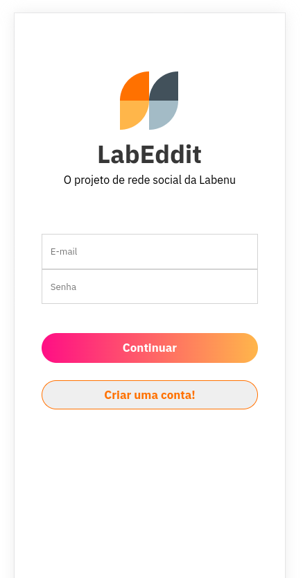
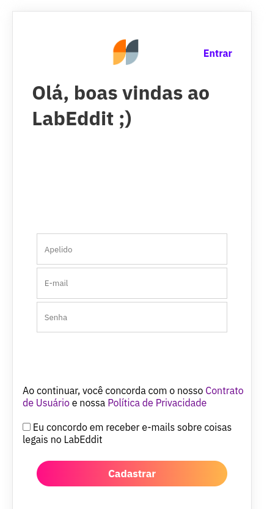
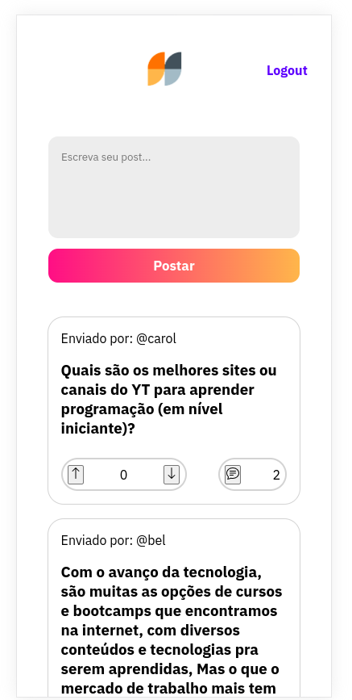
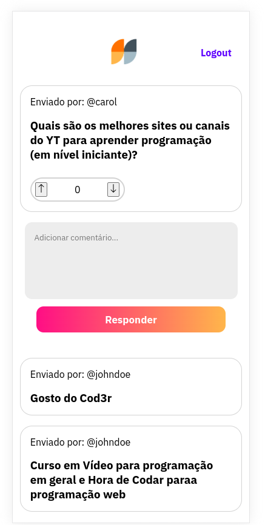

# Chatterbox Tech - Front-end

Este é o repositório front-end do projeto fullstack Chatterbox Tech, uma rede social sobre tecnologia.
Link para o repositório back-end: https://github.com/carolcampos22/chatterbox

## Tecnologias utilizadas
 - React.js
 - Styled-components

## Instalação
Clone o repositório:
 ```bash
 git clone https://github.com/carolcampos22/chatterbox-frontend.git
 ```

Acesse o repositório do projeto: 
```bash
cd chatterbox-frontend

```

Instale as dependências:
```bash
#com npm:
npm install

#ou com Yarn:
yarn install
```

Inicie o servidor:
```bash
#com npm:
npm run start

#ou com yarn:
yarn start
```

<!-- ## Site 
https://labeddit-frontend-delta.vercel.app -->

<!-- ## Layout

1. Página de login:



2. Página de cadastro:



3. Página de posts:



4. Página de comentários:

 -->

## Próximos passos
- Responsividade
- Melhorias na estilização da página de cadastro
- Light/dark mode

## Autora

#### Carolina Mendes - Web developer
[](https://www.linkedin.com/in/dev-carolina-mendes/)
